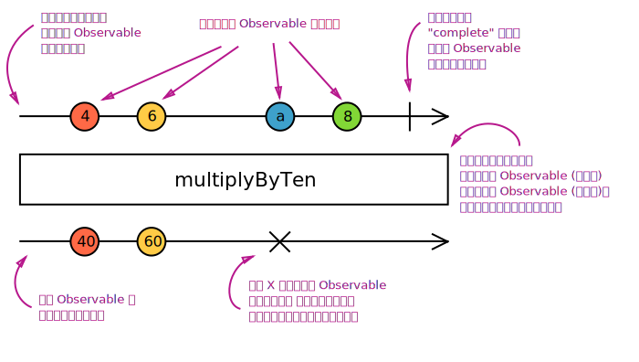

# Operators (操作符)

尽管 RxJS 的根基是 Observable，但最有用的还是它的**操作符**。操作符是允许复杂的异步代码以声明式的方式进行轻松组合的基础代码单元。

## 什么是操作符？

操作符是 Observable 类型上的**方法**，比如 `.map(...)`、`.filter(...)`、`.merge(...)`，等等。当操作符被调用时，它们不会**改变**已经存在的 Observable 实例。相反，它们返回一个**新的** Observable ，它的 subscription 逻辑基于第一个 Observable 。

<span class="informal"> 操作符是函数，它基于当前的 Observable 创建一个新的 Observable。这是一个无副作用的操作：前面的 Observable 保持不变。</span>

操作符本质上是一个纯函数 (pure function)，它接收一个 Observable 作为输入，并生成一个新的 Observable 作为输出。订阅输出 Observable 同样会订阅输入 Observable 。在下面的示例中，我们创建一个自定义操作符函数，它将从输入 Observable 接收的每个值都乘以10：

```js
function multiplyByTen(input) {
  var output = Rx.Observable.create(function subscribe(observer) {
    input.subscribe({
      next: (v) => observer.next(10 * v),
      error: (err) => observer.error(err),
      complete: () => observer.complete()
    });
  });
  return output;
}

var input = Rx.Observable.from([1, 2, 3, 4]);
var output = multiplyByTen(input);
output.subscribe(x => console.log(x));
```

输出：

```none
10
20
30
40
```

注意，订阅 `output` 会导致 `input` Observable 也被订阅。我们称之为“操作符订阅链”。

## 实例操作符 vs. 静态操作符

**什么是实例操作符？** - 通常提到操作符时，我们指的是**实例**操作符，它是 Observable 实例上的方法。举例来说，如果上面的 `multiplyByTen` 是官方提供的实例操作符，它看起来大致是这个样子的：

```js
Rx.Observable.prototype.multiplyByTen = function multiplyByTen() {
  var input = this;
  return Rx.Observable.create(function subscribe(observer) {
    input.subscribe({
      next: (v) => observer.next(10 * v),
      error: (err) => observer.error(err),
      complete: () => observer.complete()
    });
  });
}
```

<span class="informal">实例运算符是使用 `this` 关键字来指代输入的 Observable 的函数。</span>

注意，这里的 `input` Observable 不再是一个函数参数，它现在是 `this` 对象。下面是我们如何使用这样的实例运算符：

```js
var observable = Rx.Observable.from([1, 2, 3, 4]).multiplyByTen();

observable.subscribe(x => console.log(x));
```

**什么是静态操作符？** - 除了实例操作符，还有静态操作符，它们是直接附加到 Observable 类上的。静态操作符在内部不使用 `this` 关键字，而是完全依赖于它的参数。

<span class="informal">静态操作符是附加到 Observalbe 类上的纯函数，通常用来从头开始创建 Observalbe 。</span>

最常用的静态操作符类型是所谓的**创建操作符**。它们只接收非 Observable 参数，比如数字，然后**创建**一个新的 Observable ，而不是将一个输入 Observable 转换为输出 Observable 。

一个典型的静态操作符例子就是 `interval` 函数。它接收一个数字(非 Observable)作为参数，并生产一个 Observable 作为输出：

```js
var observable = Rx.Observable.interval(1000 /* 毫秒数 */);
```

创建操作符的另一个例子就是 `create`，已经在前面的示例中广泛使用。[点击这里](#creation-operators)查看所有静态操作符列表。

然而，有些静态操作符可能不同于简单的创建。一些**组合操作符**可能是静态的，比如 `merge`、`combineLatest`、`concat`，等等。这些作为静态运算符是有道理的，因为它们将**多个** Observables 作为输入，而不仅仅是一个，例如：

```js
var observable1 = Rx.Observable.interval(1000);
var observable2 = Rx.Observable.interval(400);

var merged = Rx.Observable.merge(observable1, observable2);
```

## Marble diagrams (弹珠图)

要解释操作符是如何工作的，文字描述通常是不足以描述清楚的。许多操作符都是跟时间相关的，它们可能会以不同的方式延迟(delay)、取样(sample)、节流(throttle)或去抖动值(debonce)。图表通常是更适合的工具。**弹珠图**是操作符运行方式的视觉表示，其中包含输入 Obserable(s) (输入可能是多个 Observable )、操作符及其参数和输出 Observable 。

<span class="informal">在弹珠图中，时间流向右边，图描述了在 Observable 执行中值(“弹珠”)是如何发出的。</span>

在下图中可以看到解剖过的弹珠图。



在整个文档站中，我们广泛地使用弹珠图来解释操作符的工作方式。它们在其他环境中也可能非常有用，例如在白板上，甚至在我们的单元测试中(如 ASCII 图)。

## 选择操作符

<div class="decision-tree-widget"></div>

## 操作符分类

操作符有着不同的用途，它们可作如下分类：创建、转换、过滤、组合、错误处理、工具，等等。在下面的列表中，你可以按分类组织好的所有操作符。

### 创建操作符

- `ajax`
- [`bindCallback`](../class/es6/Observable.js~Observable.html#static-method-bindCallback)
- [`bindNodeCallback`](../class/es6/Observable.js~Observable.html#static-method-bindNodeCallback)
- [`create`](../class/es6/Observable.js~Observable.html#static-method-create)
- [`defer`](../class/es6/Observable.js~Observable.html#static-method-defer)
- [`empty`](../class/es6/Observable.js~Observable.html#static-method-empty)
- [`from`](../class/es6/Observable.js~Observable.html#static-method-from)
- [`fromEvent`](../class/es6/Observable.js~Observable.html#static-method-fromEvent)
- [`fromEventPattern`](../class/es6/Observable.js~Observable.html#static-method-fromEventPattern)
- [`fromPromise`](../class/es6/Observable.js~Observable.html#static-method-fromPromise)
- [`generate`](../class/es6/Observable.js~Observable.html#static-method-generate)
- [`interval`](../class/es6/Observable.js~Observable.html#static-method-interval)
- [`never`](../class/es6/Observable.js~Observable.html#static-method-never)
- [`of`](../class/es6/Observable.js~Observable.html#static-method-of)
- [`repeat`](../class/es6/Observable.js~Observable.html#instance-method-repeat)
- [`repeatWhen`](../class/es6/Observable.js~Observable.html#instance-method-repeatWhen)
- [`range`](../class/es6/Observable.js~Observable.html#static-method-range)
- [`throw`](../class/es6/Observable.js~Observable.html#static-method-throw)
- [`timer`](../class/es6/Observable.js~Observable.html#static-method-timer)

### 转换操作符

- [`buffer`](../class/es6/Observable.js~Observable.html#instance-method-buffer)
- [`bufferCount`](../class/es6/Observable.js~Observable.html#instance-method-bufferCount)
- [`bufferTime`](../class/es6/Observable.js~Observable.html#instance-method-bufferTime)
- [`bufferToggle`](../class/es6/Observable.js~Observable.html#instance-method-bufferToggle)
- [`bufferWhen`](../class/es6/Observable.js~Observable.html#instance-method-bufferWhen)
- [`concatMap`](../class/es6/Observable.js~Observable.html#instance-method-concatMap)
- [`concatMapTo`](../class/es6/Observable.js~Observable.html#instance-method-concatMapTo)
- [`exhaustMap`](../class/es6/Observable.js~Observable.html#instance-method-exhaustMap)
- [`expand`](../class/es6/Observable.js~Observable.html#instance-method-expand)
- [`groupBy`](../class/es6/Observable.js~Observable.html#instance-method-groupBy)
- [`map`](../class/es6/Observable.js~Observable.html#instance-method-map)
- [`mapTo`](../class/es6/Observable.js~Observable.html#instance-method-mapTo)
- [`mergeMap`](../class/es6/Observable.js~Observable.html#instance-method-mergeMap)
- [`mergeMapTo`](../class/es6/Observable.js~Observable.html#instance-method-mergeMapTo)
- [`mergeScan`](../class/es6/Observable.js~Observable.html#instance-method-mergeScan)
- [`pairwise`](../class/es6/Observable.js~Observable.html#instance-method-pairwise)
- [`partition`](../class/es6/Observable.js~Observable.html#instance-method-partition)
- [`pluck`](../class/es6/Observable.js~Observable.html#instance-method-pluck)
- [`scan`](../class/es6/Observable.js~Observable.html#instance-method-scan)
- [`switchMap`](../class/es6/Observable.js~Observable.html#instance-method-switchMap)
- [`switchMapTo`](../class/es6/Observable.js~Observable.html#instance-method-switchMapTo)
- [`window`](../class/es6/Observable.js~Observable.html#instance-method-window)
- [`windowCount`](../class/es6/Observable.js~Observable.html#instance-method-windowCount)
- [`windowTime`](../class/es6/Observable.js~Observable.html#instance-method-windowTime)
- [`windowToggle`](../class/es6/Observable.js~Observable.html#instance-method-windowToggle)
- [`windowWhen`](../class/es6/Observable.js~Observable.html#instance-method-windowWhen)

### 过滤操作符

- [`debounce`](../class/es6/Observable.js~Observable.html#instance-method-debounce)
- [`debounceTime`](../class/es6/Observable.js~Observable.html#instance-method-debounceTime)
- [`distinct`](../class/es6/Observable.js~Observable.html#instance-method-distinct)
- [`distinctKey`](../class/es6/Observable.js~Observable.html#instance-method-distinctKey)
- [`distinctUntilChanged`](../class/es6/Observable.js~Observable.html#instance-method-distinctUntilChanged)
- [`distinctUntilKeyChanged`](../class/es6/Observable.js~Observable.html#instance-method-distinctUntilKeyChanged)
- [`elementAt`](../class/es6/Observable.js~Observable.html#instance-method-elementAt)
- [`filter`](../class/es6/Observable.js~Observable.html#instance-method-filter)
- [`first`](../class/es6/Observable.js~Observable.html#instance-method-first)
- [`ignoreElements`](../class/es6/Observable.js~Observable.html#instance-method-ignoreElements)
- [`audit`](../class/es6/Observable.js~Observable.html#instance-method-audit)
- [`auditTime`](../class/es6/Observable.js~Observable.html#instance-method-auditTime)
- [`last`](../class/es6/Observable.js~Observable.html#instance-method-last)
- [`sample`](../class/es6/Observable.js~Observable.html#instance-method-sample)
- [`sampleTime`](../class/es6/Observable.js~Observable.html#instance-method-sampleTime)
- [`single`](../class/es6/Observable.js~Observable.html#instance-method-single)
- [`skip`](../class/es6/Observable.js~Observable.html#instance-method-skip)
- [`skipLast`](../class/es6/Observable.js~Observable.html#instance-method-skipLast)
- [`skipUntil`](../class/es6/Observable.js~Observable.html#instance-method-skipUntil)
- [`skipWhile`](../class/es6/Observable.js~Observable.html#instance-method-skipWhile)
- [`take`](../class/es6/Observable.js~Observable.html#instance-method-take)
- [`takeLast`](../class/es6/Observable.js~Observable.html#instance-method-takeLast)
- [`takeUntil`](../class/es6/Observable.js~Observable.html#instance-method-takeUntil)
- [`takeWhile`](../class/es6/Observable.js~Observable.html#instance-method-takeWhile)
- [`throttle`](../class/es6/Observable.js~Observable.html#instance-method-throttle)
- [`throttleTime`](../class/es6/Observable.js~Observable.html#instance-method-throttleTime)

### 组合操作符

- [`combineAll`](../class/es6/Observable.js~Observable.html#instance-method-combineAll)
- [`combineLatest`](../class/es6/Observable.js~Observable.html#instance-method-combineLatest)
- [`concat`](../class/es6/Observable.js~Observable.html#instance-method-concat)
- [`concatAll`](../class/es6/Observable.js~Observable.html#instance-method-concatAll)
- [`exhaust`](../class/es6/Observable.js~Observable.html#instance-method-exhaust)
- [`forkJoin`](../class/es6/Observable.js~Observable.html#static-method-forkJoin)
- [`merge`](../class/es6/Observable.js~Observable.html#instance-method-merge)
- [`mergeAll`](../class/es6/Observable.js~Observable.html#instance-method-mergeAll)
- [`race`](../class/es6/Observable.js~Observable.html#instance-method-race)
- [`startWith`](../class/es6/Observable.js~Observable.html#instance-method-startWith)
- [`switch`](../class/es6/Observable.js~Observable.html#instance-method-switch)
- [`withLatestFrom`](../class/es6/Observable.js~Observable.html#instance-method-withLatestFrom)
- [`zip`](../class/es6/Observable.js~Observable.html#static-method-zip)
- [`zipAll`](../class/es6/Observable.js~Observable.html#instance-method-zipAll)

### 多播操作符

- [`cache`](../class/es6/Observable.js~Observable.html#instance-method-cache)
- [`multicast`](../class/es6/Observable.js~Observable.html#instance-method-multicast)
- [`publish`](../class/es6/Observable.js~Observable.html#instance-method-publish)
- [`publishBehavior`](../class/es6/Observable.js~Observable.html#instance-method-publishBehavior)
- [`publishLast`](../class/es6/Observable.js~Observable.html#instance-method-publishLast)
- [`publishReplay`](../class/es6/Observable.js~Observable.html#instance-method-publishReplay)
- [`share`](../class/es6/Observable.js~Observable.html#instance-method-share)

### 错误处理操作符

- [`catch`](../class/es6/Observable.js~Observable.html#instance-method-catch)
- [`retry`](../class/es6/Observable.js~Observable.html#instance-method-retry)
- [`retryWhen`](../class/es6/Observable.js~Observable.html#instance-method-retryWhen)

### 工具操作符

- [`do`](../class/es6/Observable.js~Observable.html#instance-method-do)
- [`delay`](../class/es6/Observable.js~Observable.html#instance-method-delay)
- [`delayWhen`](../class/es6/Observable.js~Observable.html#instance-method-delayWhen)
- [`dematerialize`](../class/es6/Observable.js~Observable.html#instance-method-dematerialize)
- `finally`
- `let`
- [`materialize`](../class/es6/Observable.js~Observable.html#instance-method-materialize)
- [`observeOn`](../class/es6/Observable.js~Observable.html#instance-method-observeOn)
- [`subscribeOn`](../class/es6/Observable.js~Observable.html#instance-method-subscribeOn)
- [`timeInterval`](../class/es6/Observable.js~Observable.html#instance-method-timeInterval)
- [`timestamp`](../class/es6/Observable.js~Observable.html#instance-method-timestamp)
- [`timeout`](../class/es6/Observable.js~Observable.html#instance-method-timeout)
- [`timeoutWith`](../class/es6/Observable.js~Observable.html#instance-method-timeoutWith)
- [`toArray`](../class/es6/Observable.js~Observable.html#instance-method-toArray)
- [`toPromise`](../class/es6/Observable.js~Observable.html#instance-method-toPromise)

### 条件和布尔操作符

- [`defaultIfEmpty`](../class/es6/Observable.js~Observable.html#instance-method-defaultIfEmpty)
- [`every`](../class/es6/Observable.js~Observable.html#instance-method-every)
- [`find`](../class/es6/Observable.js~Observable.html#instance-method-find)
- [`findIndex`](../class/es6/Observable.js~Observable.html#instance-method-findIndex)
- [`isEmpty`](../class/es6/Observable.js~Observable.html#instance-method-isEmpty)

### 数学和聚合操作符

- [`count`](../class/es6/Observable.js~Observable.html#instance-method-count)
- [`max`](../class/es6/Observable.js~Observable.html#instance-method-max)
- [`min`](../class/es6/Observable.js~Observable.html#instance-method-min)
- [`reduce`](../class/es6/Observable.js~Observable.html#instance-method-reduce)
